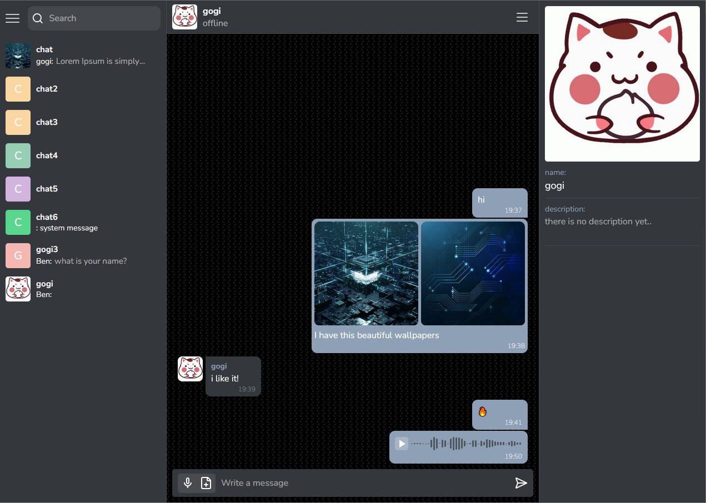

 
IN DEVELOPMENT

# Messenger

Multifunctional real-time messaging application with features such as user authentication, user roles, voice messaging and file sharing.

## Stack

Backend:
- Node js
- Express
- MongoDb
- Socket.io

Frontend:
- React
- Mobx

## Screenshots

Private and public chats with real-time messaging

Multimedia messages

Adaptation for mobile devices

*the application is under active development
